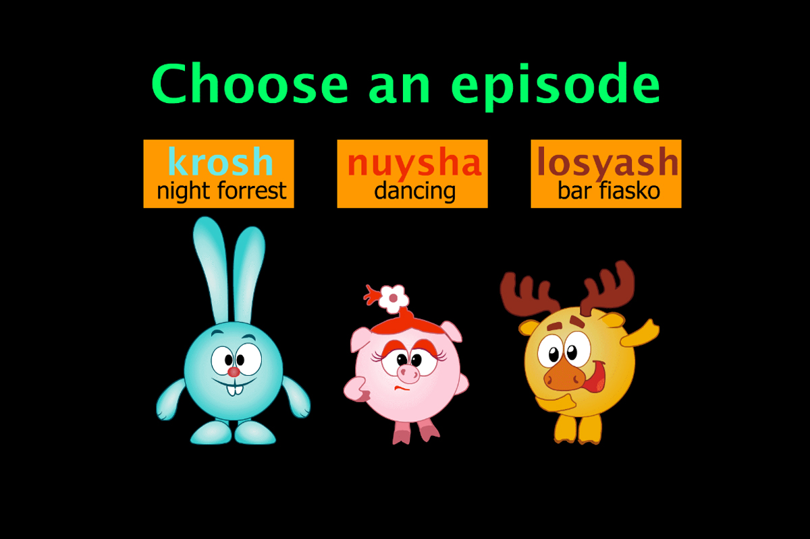

# Nuisha Adventures

[Link to Demo](http://portfolio.alexandrpasko.com)

The project is interactive clip that allows a person to choose a cartoon character and a scene and watch the animation. Flash movie is created in Adove Animation and is deployed in HTML page by HTML5 Canvas. The clip contains multiple features like motion tweens, shape tweens, selective text, streem sounds, event sounds, buttons (ActionScript commands), masks, timelines, objects build manually, and more.

## Technologies/Languages:
* HTML5 canvas
* Adoby Animation
* Timelines
* Flash Movie
* Event Sounds

## Screenshot:
